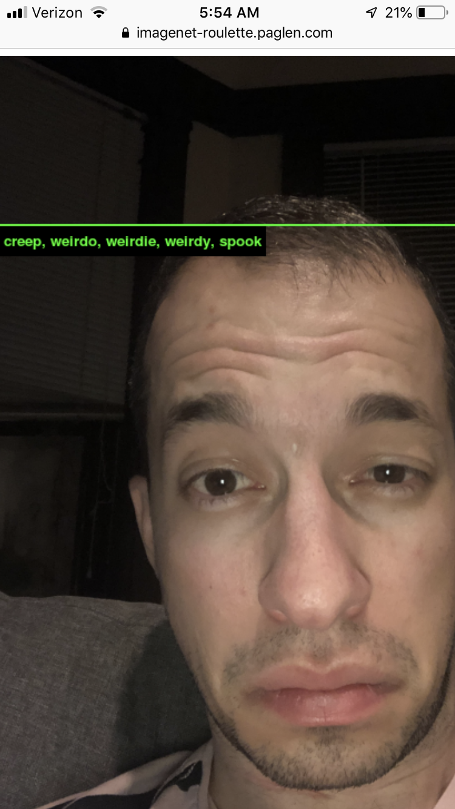

# Session 01: 01.28.2020

## Agenda:
1. Syllabus/Introductions
1. Computer Vision/Machine Learning overview
1. Set up VS Code
1. Set up GitHub Account
1. Set up Basic web/p5.js project
1. P5.js Creative Coding basics
1. "Rozin Mirror" workshop

_convert 2-dimensional data to single-dimension data: z = y * width + x_

 
 

_I found my imagenet-roulette capture_

Random notes:
* When you get to class, make sure to save any work you have open in other programs, and close it down. The only programs you should have open are the ones we work on in class.